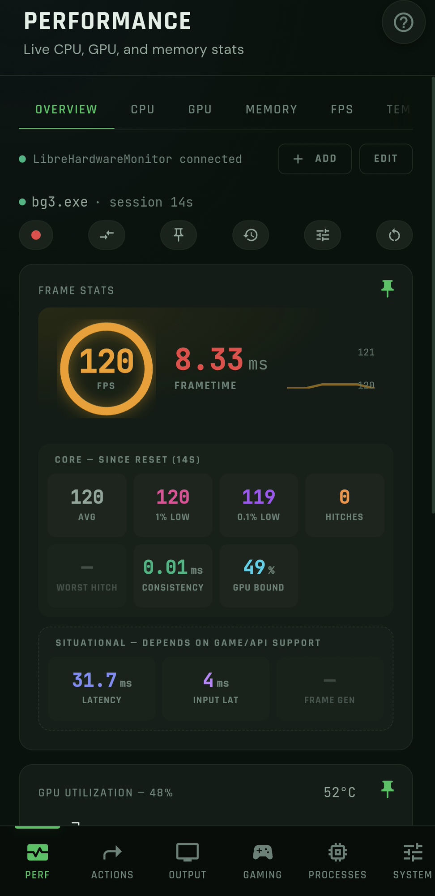
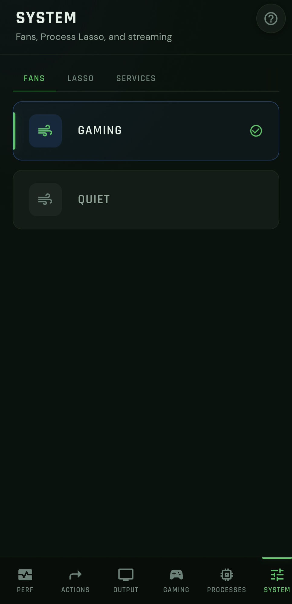
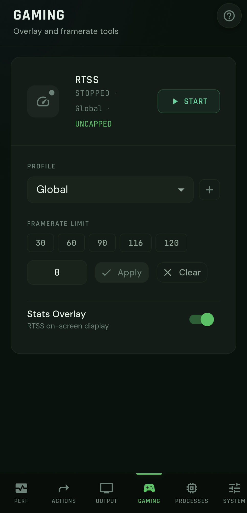
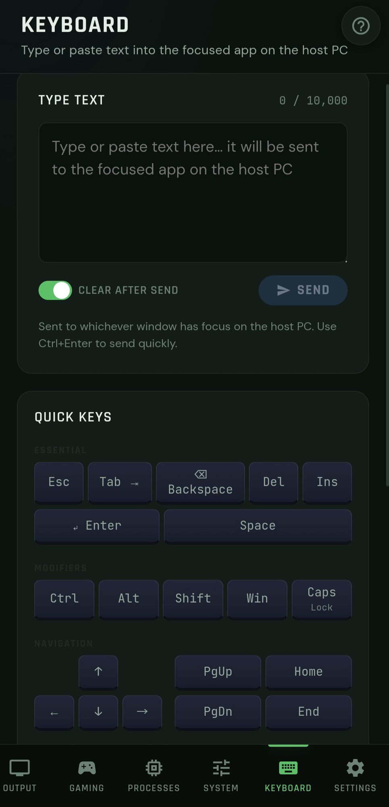
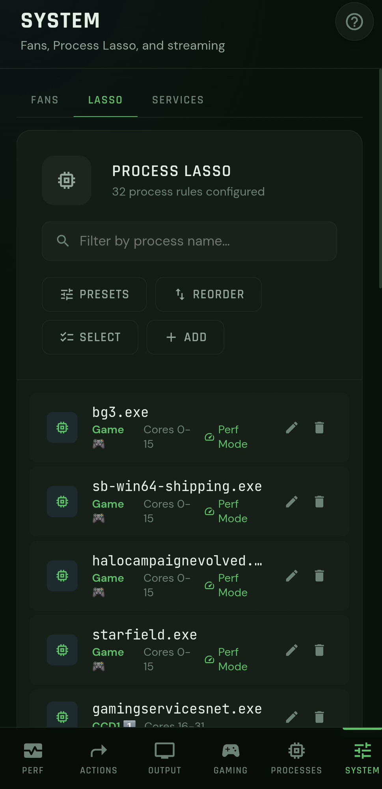
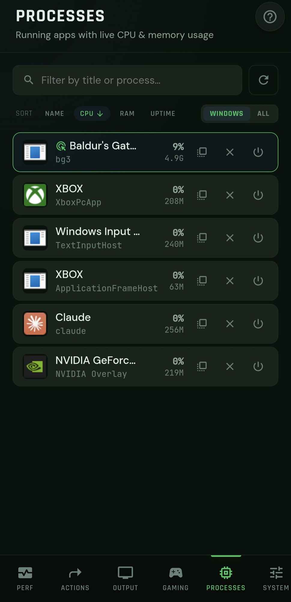
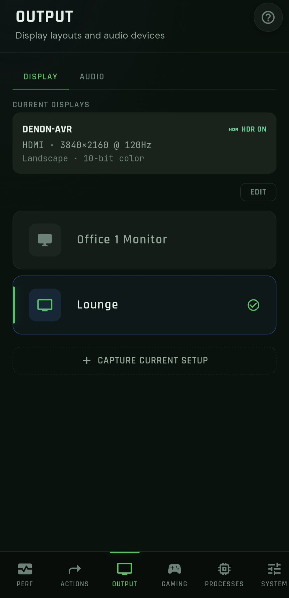
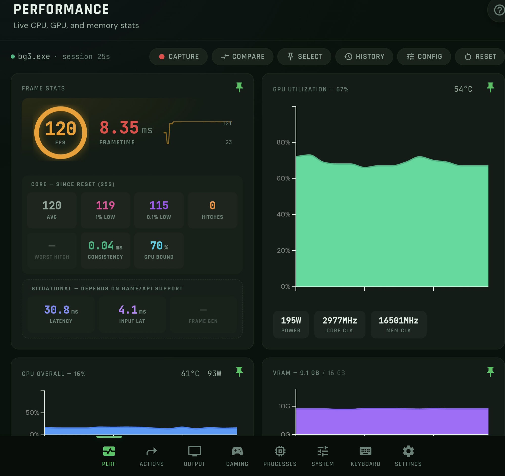

# HandyMon

A local-network web dashboard for controlling your Windows PC — switching display configurations, audio devices, and fan profiles, running one-tap Actions, checking live performance stats, and more — from your phone or any browser on your LAN.

No cloud account, no external service. HandyMon runs quietly in your system tray and talks to your PC directly over your own network.

**[⬇ Download the latest installer](https://github.com/ConcreteLlama/HandyMon/releases/latest)** — Windows 11, nothing else required to get started.

## Screenshots

<table>
<tr>
<td width="33%"><br><sub>Performance overview, pinned cards</sub></td>
<td width="33%"><br><sub>Fan profile switching</sub></td>
<td width="33%"><br><sub>RTSS framerate limit + overlay</sub></td>
</tr>
<tr>
<td width="33%"><br><sub>Remote keyboard input</sub></td>
<td width="33%"><br><sub>Process Lasso CPU/priority rules</sub></td>
<td width="33%"><br><sub>Running processes, CPU &amp; RAM</sub></td>
</tr>
<tr>
<td width="33%"><br><sub>Saved display configurations</sub></td>
</tr>
</table>


<sub>Performance dashboard on a wider screen — grid view auto-fits pinned cards</sub>

## Features

- **Actions** — build a sequence from launch/hotkey/keysequence/text/delay/display/audio/fan steps (and other Actions) and trigger it in one tap — a single Action can switch display layout, audio output, and fan profile, then launch a game, all in order
- **Display switching** — native Windows CCD API interop, no external tool required
- **Audio device switching + volume control** — native Windows Core Audio COM interop, no external tool required
- **Fan profiles** — via FanControl
- **Live performance monitoring** — CPU/GPU temps, power, clocks, fan RPM (via LibreHardwareMonitor), in-game FPS/frametime capture (via PresentMon), and a customizable pinned overview dashboard
- **Process management** — CPU/RAM usage, kill/close, CPU-affinity control (via Process Lasso)
- **Generic Services** — start/stop any Windows service or scheduled task you configure
- **Device pairing** — QR-code pairing with per-device permission grants; the host PC always has full access, paired devices get only what you grant them

See [docs/features.md](docs/features.md) for the full feature-by-feature breakdown.

## Installing

1. Download the installer from the [latest release](https://github.com/ConcreteLlama/HandyMon/releases/latest).
2. Run it. It'll ask for administrator rights once, to register the background service that lets it switch displays/audio/fans (Windows requires elevation for that).
3. Once installed, HandyMon starts automatically at login and lives in your system tray.
4. To use it from your phone: right-click the tray icon → **Pair new device** → scan the QR code.

A full getting-started guide (tray icon, setting up optional tools, troubleshooting) is bundled with the installer and opens automatically on first launch — or find it anytime via **HandyMon Help** in the Start Menu.

**Requirements:** Windows 11, and a phone/browser on the same local network as the PC. Whichever of the external tools above you want to use (each is optional independently) — see [docs/windows-dependencies.md](docs/windows-dependencies.md) for install links.

To uninstall: **Uninstall HandyMon** from the Start Menu, or Windows Settings → Apps. Your configuration and Actions are kept (`%LOCALAPPDATA%\HandyMon`) in case you reinstall later.

## Running from source

For development, or if you'd rather not use the installer:

```bash
npm install
npm run dev
```

See [SETUP.md](SETUP.md) for a full first-run walkthrough (configuring tool paths, adding your first Action), and [docs/startup.md](docs/startup.md) for always-on background operation (tray icon + auto-start at logon) from a git checkout.

## Documentation

- [CLAUDE.md](CLAUDE.md) — project orientation (tech stack, directory layout, key facts)
- [docs/architecture.md](docs/architecture.md) — request lifecycle, React Query pattern, service abstraction
- [docs/features.md](docs/features.md) — every feature: API routes, utils, components, hooks
- [docs/windows-dependencies.md](docs/windows-dependencies.md) — all external tools and hardcoded paths
- [docs/data-models.md](docs/data-models.md) — key types and Zod schemas
- [docs/startup.md](docs/startup.md) — scheduled task, tray wrapper, port config, release pipeline
- [docs/development.md](docs/development.md) — dev workflow, npm scripts

## License

MIT — see [LICENSE](LICENSE).
